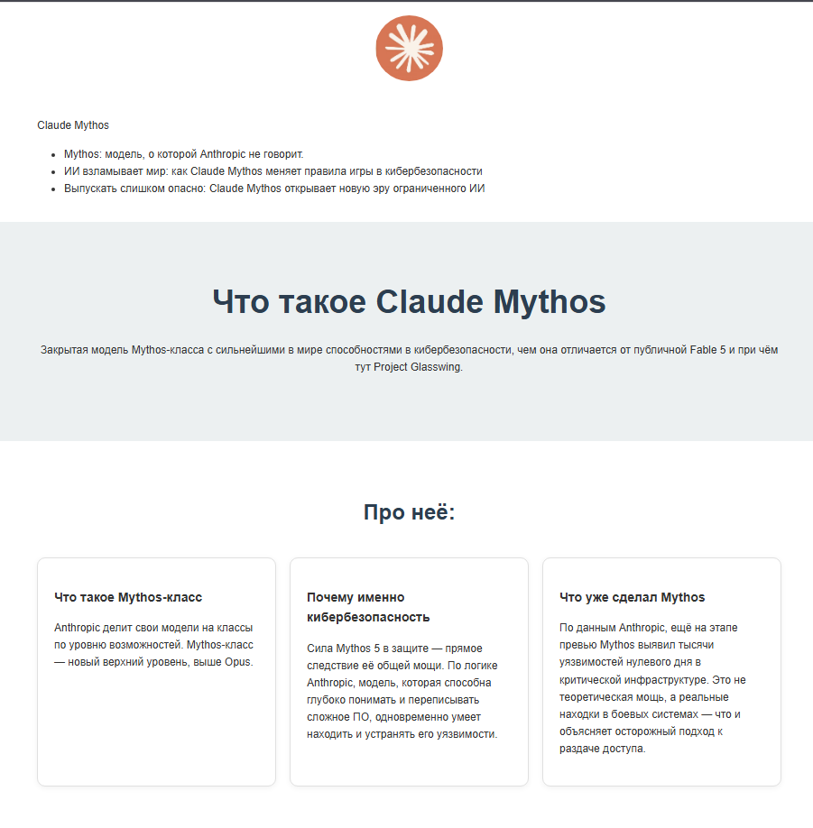

## MY FIRST LANDING

Одностраничный сайт-визитка, свёрстанный на чистом HTML + CSS.
Первый проект в обучении по фронтенду.

## СКРИНШОТ 

## ТЕХНОЛОГИИ 

- HTML5
- CSS
- Git & GitHub

## ЧТО РЕАЛИЗОВАНО 
- Семантическая разметка 
- Блочная модель: padding, margin, border
- Flexbox Для шапки и карточек 
- Псведо-класс :hover для кнопки и ссылок 

## как запустить 

1. скачать репозиторий 
2. открыть index.html
3. использовать Live Servis 

## Автор:

Nemesis — [GitHub](https://github.com/Chuhla)